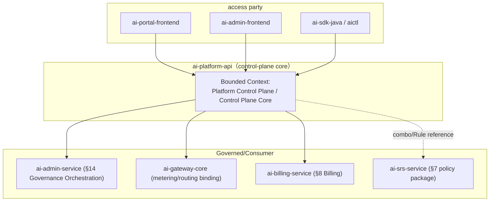
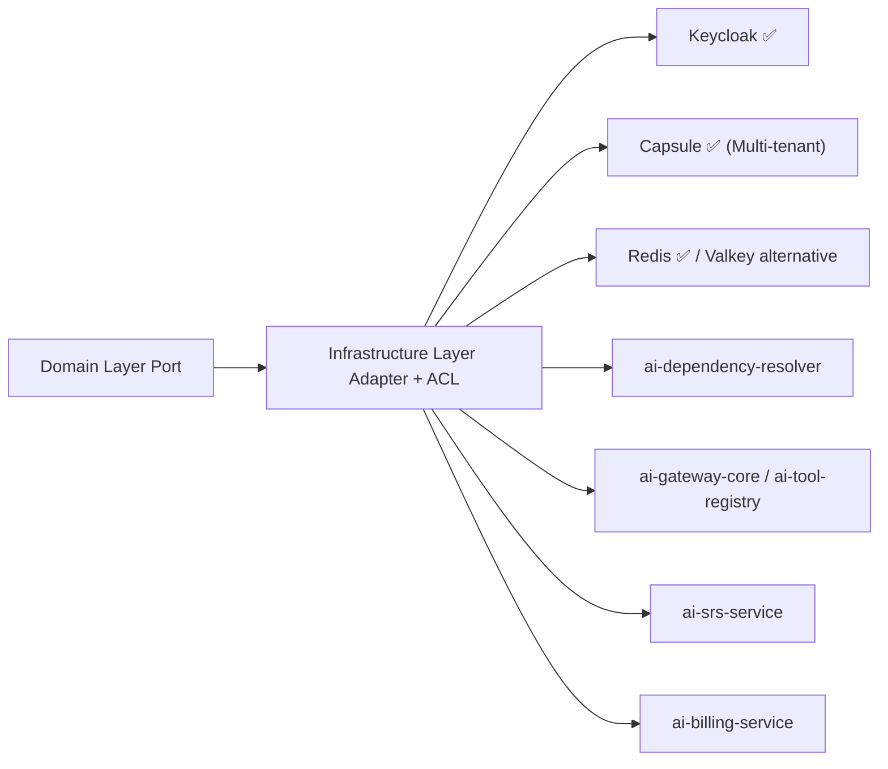
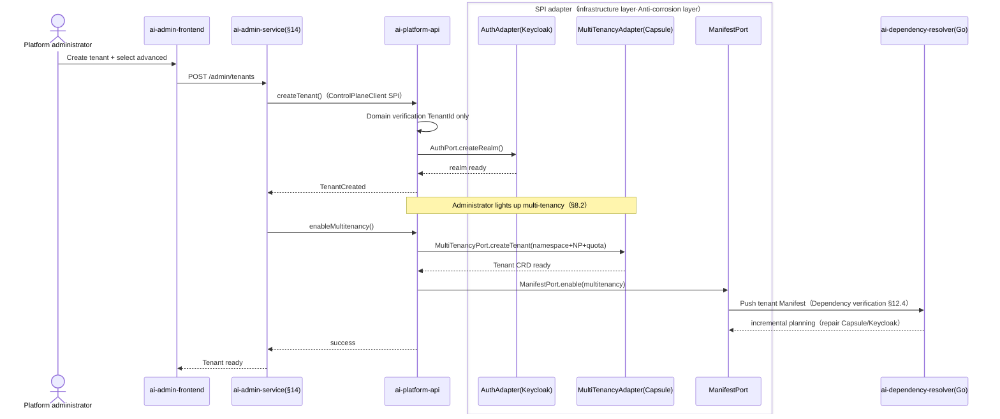
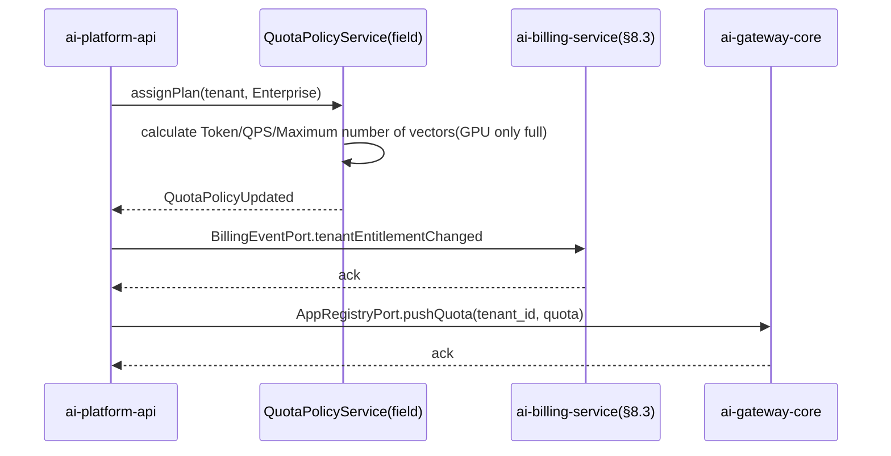

# ai-platform-api · Detailed design document

> **Meta Information**
> | item | value |
> | --- | --- |
> | repo | `ai-platform-api` |
> | Language · Framework | Java · Spring Boot 3.x (Jakarta Persistence/MyBatis-Flex, §15.5.1) |
> | Domain | control-plane (core of platform control plane) |
> | optional | No (core, starter~full enabled, see `repos.yaml` / `profiles/*.yaml`) |
> | Platform version | v1.0.0 |
> | Document Status | Draft |
> | Responsible person | OpenStrata Architecture Group |
> | Related links | [arch](./arch/ARCH.md) · [skills](./skills/SKILLS.md) · [specs](./specs/SPECS.md) · Architecture document [§4.1](../../OpenStrata Architecture Design Document v2.8.md) [§8](../../OpenStrata Architecture Design Document v2.8.md) [§12](../../OpenStrata Architecture Design Document v2.8.md) [§14](../../OpenStrata Architecture Design Document v2.8.md) [§15.5](../../OpenStrata Architecture Design Document v2.8.md) [§16](../../OpenStrata Architecture Design Document v2.8.md) |

> This document covers the existing placeholder skeleton (`design/DESIGN.md` top template) without changing `arch/`, `skills/`, `specs/`, `README.md`. Chapters are strictly organized into 16 sections, and live ```mermaid``` is used throughout the figures.

---

## 1. Domain context and boundary (Bounded Context)

`ai-platform-api` is the **platform control plane core API** of OpenStrata, carrying the authoritative domain model and write operations of "tenant/user/application/package/quota/multi-tenant lighting". It is the unified backend for `ai-portal-frontend`, `ai-admin-frontend`, `ai-sdk-java`, CLI (`aictl`), and the source of truth for `ai-admin-service` (Admin Portal backend, §14) and downstream data plane/billing services.



- **Boundary (upstream)**: Only accepts requests authenticated by `Auth` SPI (Keycloak, §4.7.3) with `tenant_id`; it does not do model inference, RAG, or metering collection.
- **Boundary (Downstream)**: Call Keycloak (Auth), Capsule/K8s (MultiTenancy), Redis (Cache) through the **SPI port** + Anti-Corruption Layer (ACL) defined by the domain layer, and write the "Tenant/User/Application/Quota" fact to PostgreSQL (base, §16).
- **Relationship with ai-admin-service**: platform-api is the **domain authority (data + rules)**; admin-service is the **governance orchestration backend**, responsible for making the platform administrator's package/quota decisions into the tenant-level `PlatformManifest` (§12) and linking Capsule/Kueue/Keycloak. The two are decoupled through the internal `ControlPlaneClient` SPI (ACL), and admin-service does not directly write the library of platform-api.
- **Optional**: core, all four levels of presets (starter/standard/advanced/full) are enabled, port 8081 (§15.2).

---

## 2. List of responsibilities and abilities (mapping §4 responsibilities at each level)

Aligning the hierarchical responsibilities of the architecture document §4, this service focuses on the "domain authority" part of the **control-plane** and **security governance and multi-tenant layer (§4.7)**:

| Capabilities | Description | Mapping § |
| --- | --- | --- |
| Tenant life cycle | Creation/configuration/start/stop/logout; `tenant_id` is globally unique and runs through all resources (§8.1) | §4.7.1 / §8.1 |
| User and identity binding | User CRUD, invitation/deactivation, and Keycloak account mapping (§4.7.3) | §4.7.3 / §14.3 |
| Application (Agent application) management | Application registration, binding models/tools, and writing `AgentSpec` metadata (§4.3.5) | §4.3.5 |
| Packages and quota templates | Trial/Standard/Enterprise presets, bound to CPU/Token/QPS/vector quotas (§8.1, §14.2) | §8.1 / §14.2 |
| Multi-tenancy on | Press `multitenancy.enabled` to drive Capsule Tenant + Namespace + NetworkPolicy + Data Prefix (§8.2) | §8.2 / §12.1 |
| Permissions and Approvals | RBAC (platform-admin/tenant-admin/developer/viewer, §14.3) + high-risk operation approval flow | §4.7.3/§14.3 |
| Component-wide delivery | Set the tenant to enable the component whitelist and write the tenant-level `PlatformManifest` (§12.1) | §12 / §14.2 |
| Vendor Authorization | Per-tenant third-party model (available only for Enterprise GPT-4o et al., §14.2) | §14.2 |
| Audit traces | All tenant/user/quota/application change traces (audited even if `security` is not enabled, §14.6) | §4.7.4 / §14.6 |

> Not doing: gateway routing/metering collection (ai-gateway-core), settlement and accounting (ai-billing-service, §8.3), RAG/memory (memory/rag), Agent runtime. These collaborate via the SPI port (§6, §9).

---

## 3. Domain model (Aggregate / Entity / Value Object / Domain events)

Follow §15.5.2 DDD four layers; the domain layer has zero external dependencies and only defines ports.


**Aggregate (aggregate root)**
- `Tenant` (aggregate root): encapsulates the consistency boundary of `User` / `Application` / `Plan` / `Quota` / `Entitlement` / `ModelGrant`; multi-tenant lighting is a domain behavior within the aggregate.
- `Application` (aggregate root): independent lifecycle, referenced by `AgentSpecRef` (`apiVersion/kind/metadata.name`, §4.3.5).

**Entity**: `User`, `Plan`, `Quota`, `Entitlement`, `ModelGrant`, `AgentSpecRef`.

**Value Object (value object)**: `TenantId`, `UserId`, `AppId`, `PlanId`, `QuotaId`, `TenantStatus` (enum: PROVISIONING/ACTIVE/SUSPENDED/DELETED ), `Role` (platform-admin/tenant-admin/developer/viewer), `ResourceDimension` (CPU/TOKEN/QPS/VECTOR/GPU), `QuotaTemplate`.

**Domain Event (DomainEvent, delivered asynchronously via Spring `ApplicationEvent`/Domain Event Table)**
- `TenantCreated` → triggers Capsule Tenant creation (MultiTenancy SPI) and Keycloak realm initialization (Auth SPI).
- `TenantMultitenancyEnabled` → triggers Namespace/NetworkPolicy/ResourceQuota delivery.
- `PlanChanged` → Recalculate and verify the `Quota` upper limit, publish `QuotaPolicyUpdated`.
- `EntitlementChanged` → Override tenant-level `PlatformManifest.spec` (via `ManifestPort`).
- `UserRoleChanged` / `UserInvited` → Sync Keycloak role/client mapping.
- `ApplicationRegistered` → Register the broadcast with the gateway/tool ​​(via `AppRegistryPort`).

---

## 4. Application layer use cases (Application Service & Use Case list)

The application layer (§15.5.2 ②) arranges domain objects and defines transaction boundaries (Spring `@Transactional`). CQRS: writes Command and reads Query (Projection).

| Use Case | Application Service | Transaction | Trigger domain events |
| --- | --- | --- | --- |
| Create Tenant | `TenantAppService.createTenant()` | Write | `TenantCreated` |
| Start/stop/cancel tenant | `TenantAppService.suspend/resume/delete()` | Write | `TenantSuspended/Deleted` |
| Light up multi-tenancy | `TenantAppService.enableMultitenancy()` | Write | `TenantMultitenancyEnabled` |
| Invite/disable users | `UserAppService.invite/disable()` | Write | `UserInvited/Disabled` |
| Change user role | `UserAppService.changeRole()` | Write | `UserRoleChanged` |
| Register/unregister application | `ApplicationAppService.register/unregister()` | Write | `ApplicationRegistered/Unregistered` |
| Set/Change Plan | `PlanAppService.assignPlan()` | Write | `PlanChanged` → `QuotaPolicyUpdated` |
| Adjust quota | `QuotaAppService.updateQuota()` | Write | `QuotaPolicyUpdated` |
| Set component whitelist | `EntitlementAppService.setEntitlements()` | Write | `EntitlementChanged` |
| Authorization model provider | `ModelGrantAppService.grant()` | Write | `EntitlementChanged` |
| Query tenant resource profile | `TenantQueryService.getProfile()` | Read | — (Read Projection) |
| Approve high-risk operations | `ApprovalAppService.submit/approve()` | Write | `ApprovalDecided` |

> Each Use Case performs DTO↔domain object conversion at the entrance, and the exit is unified `ApiResponse<T>`; cross-aggregation consistency is guaranteed by the aggregate root method, and cross-service consistency goes through the Saga/event in §9.

---

## 5. Domain services and core business rules

Domain services (§15.5.2 ③) carry cross-entity rules, are purely logical and can be individually tested:

- **`QuotaPolicyService`**: Calculate the upper limit of each dimension based on `Plan.quotaTemplate`; rule - the number of Token/QPS/vector is advanced and from the default governance dimension (§14.4 / §8.1 D5), the GPU quota will only actually take effect when the tenant enables self-hosted inference (full file `modelServing.enabled`, §12.1).
- **`MultitenancyProvisioningRule`**: It is only allowed to be lit when `multitenancy.enabled=true` and `auth` is turned on (§12.4 Dependency Verification); after being lit, it is forced that "data does not leave the tenant" (§14.2).
- **`EntitlementConsistencyRule`**: The component whitelist must be compatible with `PlatformManifest` (see §12.4 for dependency diagram); turning on `billing` must have `multitenancy` enabled (§12.4 table).
- **`ModelGrantRule`**: Enterprise tenants can grant restricted models such as GPT-4o (§14.2); via vendor grant semantics of the `LLMProvider` SPI (§4.4.4).
- **`TenantIdUniquenessRule`**: Globally unique, falling into PostgreSQL unique constraint + domain verification.
- **`ApprovalRule`**: High-risk operations (such as deleting tenants, exceeding budget increases) must pass `ApprovalDecided`, and the rules can be loaded as OPA/Drools policies (via `PolicyRulePort` ACL) through the Rules (§7.3) of `ai-srs-service`.

---

## 6. SPI port and adapter (Port definition + Adapter + ACL anti-corrosion layer, mapping §10.4)

The domain layer (③) only defines the **Port interface**, and the infrastructure layer (④) implements the **Adapter + anti-corrosion layer**. Multiple implementations of the same type can coexist with zero changes when switching (§10.4, §15.5.4).

| Port (domain layer definition) | SPI port (§10.3/bom.yaml) | Adapter implementation (default ✅ / alternative) | ACL responsibility |
| --- | --- | --- | --- |
| `AuthPort` | `Auth` (§4.7.3) | **Keycloak@25.0.0 ✅** (Apache-2.0, core) | Convert external tokens/claims to internal `TenantContext`/`Role` |
| `MultiTenancyPort` | `MultiTenancy` (§8.2) | **Capsule@1.9.0 ✅** (Apache-2.0, optional, multi-tenant only) | Tenant CRD ⇄ Internal `IsolationSpec` mapping |
| `CachePort` | `Cache` (§4.3.4) | **Redis@7.4.0 ✅** (core default; Valkey@7.2.0 optional OSI alternative, §16.3) | Tenant-level key prefix isolation |
| `ManifestPort` | — (Configuration driver, §12) | Local YAML/PostgreSQL + delivered via `ai-dependency-resolver` (Go) | Manifest DTO ⇄ Internal `TenantConfig` |
| `AppRegistryPort` | — | REST call `ai-gateway-core` / `ai-tool-registry` | Internal `Application` ⇄ Gateway/Tool Schema |
| `PolicyRulePort` | — (§7.3) | REST call to `ai-srs-service` (Rules) | Rego/Drools policy ⇄ internal `ApprovalRule` |
| `BillingEventPort` | — (§8.3) | Events/REST calls to `ai-billing-service` | Tenant/Quota change events ⇄ Billing metering enabled |
| `ControlPlaneClient` | — | REST call (for consumption by `ai-admin-service`) | Internal domain object ⇄ admin DTO (anti-corrosion) |



> **Example of multiple implementations coexisting**: Redis (core) and Valkey (optional OSI, compliance-sensitive scenario switching) under `CachePort` coexist through the same Port, with zero business changes (§10.4 / §16.3). `MultiTenancyPort` only injects Capsule Adapter when `multitenancy.enabled=true`, otherwise it is an empty implementation (P10: 0 Adapters = ability skipped).

---

## 7. External API contract (REST/gRPC critical path, status code, error code, OpenAPI key points)

REST (Spring MVC + SpringDoc OpenAPI 3), base prefix `/api/v1`, routed via `ai-gateway-core` (§4.1.2). gRPC is only used in `ai-admin-service` ↔ `ai-platform-api` internal `ControlPlaneClient` (see `specs/` for proto).

**Critical Path**

```text
POST   /api/v1/tenants                              #Create tenant
GET    /api/v1/tenants/{tenantId}                   #Tenant details
PATCH  /api/v1/tenants/{tenantId}                   #Start/Stop/Change Package
POST   /api/v1/tenants/{tenantId}/multitenancy:enable
GET    /api/v1/tenants/{tenantId}/users
POST   /api/v1/tenants/{tenantId}/users:invite
PATCH  /api/v1/tenants/{tenantId}/users/{userId}:role
GET    /api/v1/tenants/{tenantId}/applications
POST   /api/v1/tenants/{tenantId}/applications
PUT    /api/v1/tenants/{tenantId}/plans             #Set package
PUT    /api/v1/tenants/{tenantId}/quotas            #Adjust quota
PUT    /api/v1/tenants/{tenantId}/entitlements      #Component whitelist
PUT    /api/v1/tenants/{tenantId}/model-grants      #Model supplier authorization
GET    /api/v1/tenants/{tenantId}/profile           #Resource Portraits (read)
POST   /api/v1/tenants/{tenantId}/approvals         #Submit for approval
GET    /api/v1/release/manifest                      #Alignment §16.4 Read-only capability list
```

**Status code**: 2xx success; `400` parameter/business rule violation; `401` unauthenticated; `403` unauthorized/unauthorized model; `404` aggregate root does not exist; `409` `tenant_id` conflict/quota conflict; `422` Manifest dependency verification failed (§12.4); `429` tenant QPS quota exhausted; `500` interior.

**Error code (business code, unified `ApiError`)**

```json
{
  "code": "TENANT_QUOTA_GPU_DISABLED",
  "message": "GPU quota only takes effect when self-hosted inference (full file modelServing) is enabled",
  "traceId": "b3b1...",
  "doc": "https://docs.openstrata.io/errors/TENANT_QUOTA_GPU_DISABLED"
}
```

**OpenAPI Important**: `openapi.yaml` is generated by SpringDoc and archived in `specs/`; all paths with `X-Tenant-Id` header and `Bearer`; `release/manifest` is consistent with §16.4; Schema reuses `AgentSpec` (§4.3.5) references.

---

## 8. Data model and persistence (table structure / JPA / migration script)

Base: PostgreSQL@16.0 (core, §16 base). JPA (Hibernate 6/Jakarta Persistence). Multi-tenant data isolation uses **Schema per tenant + RLS** (§8.2 Isolation Matrix).

```sql
-- Platform control surface library（shared schema: platform_cp）
CREATE TABLE tenants (
  tenant_id     VARCHAR(64) PRIMARY KEY,
  name          VARCHAR(128) NOT NULL,
  status        VARCHAR(16)  NOT NULL DEFAULT 'PROVISIONING',
  plan_id       VARCHAR(32),
  multitenancy  BOOLEAN      NOT NULL DEFAULT FALSE,
  created_at    TIMESTAMPTZ  NOT NULL DEFAULT now(),
  updated_at    TIMESTAMPTZ  NOT NULL DEFAULT now()
);

CREATE TABLE users (
  user_id    VARCHAR(64) PRIMARY KEY,
  tenant_id  VARCHAR(64) NOT NULL REFERENCES tenants(tenant_id),
  email      VARCHAR(256) NOT NULL,
  role       VARCHAR(16)  NOT NULL,
  status     VARCHAR(16)  NOT NULL DEFAULT 'INVITED',
  kc_id      VARCHAR(64),                       -- Keycloak mapping
  UNIQUE (tenant_id, email)
);

CREATE TABLE applications (
  app_id     VARCHAR(64) PRIMARY KEY,
  tenant_id  VARCHAR(64) NOT NULL REFERENCES tenants(tenant_id),
  name       VARCHAR(128) NOT NULL,
  agentspec_ref VARCHAR(256)                   -- apiVersion/kind/name (§4.3.5)
);

CREATE TABLE plans (
  plan_id         VARCHAR(32) PRIMARY KEY,
  name            VARCHAR(64) NOT NULL,
  quota_template  JSONB NOT NULL                -- {cpu,token,qps,vector,gpu}
);

CREATE TABLE quotas (
  quota_id   VARCHAR(64) PRIMARY KEY,
  tenant_id  VARCHAR(64) NOT NULL REFERENCES tenants(tenant_id),
  dimension  VARCHAR(16) NOT NULL,             -- CPU/TOKEN/QPS/VECTOR/GPU
  limit_val  BIGINT NOT NULL,
  used_val   BIGINT NOT NULL DEFAULT 0,
  UNIQUE (tenant_id, dimension)
);

CREATE TABLE entitlements (
  tenant_id  VARCHAR(64) NOT NULL REFERENCES tenants(tenant_id),
  component   VARCHAR(48) NOT NULL,            -- gateway/rag/srs/billing...
  allowed     BOOLEAN NOT NULL DEFAULT FALSE,
  PRIMARY KEY (tenant_id, component)
);

CREATE TABLE model_grants (
  tenant_id VARCHAR(64) NOT NULL REFERENCES tenants(tenant_id),
  provider  VARCHAR(32) NOT NULL,
  model     VARCHAR(64) NOT NULL,
  PRIMARY KEY (tenant_id, provider, model)
);

CREATE TABLE audit_log (                       -- Immutable auditing（§4.7.4/§14.6）
  id          BIGSERIAL PRIMARY KEY,
  tenant_id   VARCHAR(64),
  actor       VARCHAR(64) NOT NULL,
  action      VARCHAR(64) NOT NULL,
  payload     JSONB,
  created_at  TIMESTAMPTZ NOT NULL DEFAULT now()
);
```

**JPA entity**: `TenantEntity`/`UserEntity`/... are mapped to the above table; `@Convert` serializes `quota_template`/`payload` JSONB; migrate using **Flyway** (V1__init.sql, V2__rls.sql), and the script is shipped with `src/main/resources/db/migration/`.

---

## 9. Key business processes and sequence diagrams (Mermaid sequence, including cross-service SPI calls)

**Process A: Create tenants and enable multi-tenancy (advanced file)**



**Process B: Set package → Quota takes effect → Billing linkage (§8.1/§8.3)**



---

## 10. Configuration and Profile (align meta profiles: starter~full + optional capability switch)

The service process's own configuration (`application.yml` / `infrastructure/config/platform-api.yaml`), **capability switch alignment `profiles/*.yaml` and `PlatformManifest.spec` (§12.1)**:

```yaml
openstrata:
  service:
    port: 8081
  features:                       #Alignment §12.1 Manifest spec switch
    multitenancy:
      enabled: false              # starter/standard=false；advanced/full=true（§12.2）
    billing:
      enabled: false              #Only multi-tenant (advanced/full) linkage ai-billing-service
    security:
      enabled: false              #Advanced guardrail (Skills/Rules) via ai-srs-service; basic risk control core is always open
    riskControl:
      enabled: true               #Core is enabled by default (§4.7.4): rate limiting + injection/PII scanning
  spi:
    auth:
      provider: keycloak          #core default (§4.7.3)
    multitenancy:
      provider: capsule          #optional, only multi-tenant is lit
    cache:
      provider: redis             #Default; valkey is the OSI alternative (§16.3)
```

| Profile | Key points for enabling this service |
| --- | --- |
| starter | `multitenancy=false`、`billing=false`、`auth=keycloak`、`cache=redis` |
| standard | Same as starter (still single tenant) |
| advanced | `multitenancy=true` (Capsule Adapter injection), `billing` linkage enabled |
| full | Same as advanced + `security` advanced guardrail (authorized ai-srs-service) |

> Switches are injected by `ai-dependency-resolver` according to Manifest, the process is **stateless**, and the configuration is external (§15.5.2 Cloud native).

---

## 11. Integration point (other dependent services/SPI/external OSS, reference bom.yaml)

| Integration Point | Type | Instance (bom.yaml) | Description |
| --- | --- | --- | --- |
| Keycloak | External OSS (Auth SPI) | keycloak@25.0.0 ✅ core | Authentication/user/role (§4.7.3) |
| Capsule | External OSS (MultiTenancy SPI) | capsule@1.9.0 optional | Multi-tenancy only (§8.2) |
| Redis / Valkey | External OSS (Cache SPI) | redis@7.4.0 ✅ core / valkey@7.2.0 optional | Cache/session (§16.3) |
| PostgreSQL | base base | postgresql@16.0 ✅ core | persistence (§16 base) |
| ai-dependency-resolver | Internal services | Go, tag v1.0.0 | Manifest dependency resolution and delivery (§13.3) |
| ai-admin-service | Internal service | Java, tag v1.0.0 | Management, orchestration and consumption of this service (§14) |
| ai-gateway-core | Internal Services | Go, tag v1.0.0 | Quota/App Registration Push (§15.2) |
| ai-billing-service | Internal service | Java, tag v1.0.0 | Billing linkage (§8.3, multi-tenant only) |
| ai-srs-service | Internal Service | Java, tag v1.0.0 | Rules/Policy Package (§7.3, optional) |
| ai-tool-registry | Internal Services | Go, tag v1.0.0 | Application ↔ Tool Schema (§4.3.2) |

---

## 12. Security and multi-tenancy (authentication/permissions/data isolation/auditing, mapping §8·§14)

- **Authentication**: All requests go through `AuthPort` (Keycloak OIDC/JWT), the gateway injects `X-Tenant-Id`; `ControlPlaneClient` mTLS is used between services (Istio, §4.7.3).
- **Permissions**: RBAC four roles (platform-admin / tenant-admin / developer / viewer, §14.3); strict separation of platform-level vs tenant-level scopes; administrator operation MFA (§14.6).
- **Data Isolation**: The control-plane library uses `tenant_id` column-level isolation + RLS; after multi-tenant is turned on, business data flows **Schema per tenant + RLS / Milvus Collection prefix / MinIO Bucket** (§8.2 Matrix). This service itself does not hold vector/object data and only issues isolation policies.
- **Audit**: `audit_log` is immutable and leaves full traces (even if `security` is not turned on, management changes are audited, §14.6); audit events are also entered into OTel (§13 Observability).
- **Multi-tenant lighting conditions**: `multitenancy.enabled=true` and `auth` is turned on (§12.4 dependency verification); otherwise, the entire layer is skipped (§4.7 single-tenant form).

---

## 13. Observability (log/tracking/metrics/audit points)

- **Basic Tracing + Audit (core, §4.8)**: OpenTelemetry traces full link + immutable `audit_log` is enabled by default.
- **Metrics (recommended)**: Micrometer → Prometheus; key indicators: `tenant_count`, `quota_used_ratio{dimension}`, `api_qps`, `api_error_rate`, `approval_pending`, `spi_adapter_calls{port,provider}`.
- **Logging**: Structured JSON (MDC injects `tenant_id`/`traceId`), Loki collection (optional).
- **LLM Special Tracing**: Not generated directly, but audit/operation events can be related via `Tracing` SPI (Langfuse@2.0.0 ✅).
- **Audit Instrumentation**: `@Audit` annotations are uniformly placed in `audit_log` in the application layer aspects, including actor/action/payload/traceId.

---

## 14. Deployment and elasticity (K8s resources/HPA/probes)

- **Deployment**: `ai-platform-api`, stateless, 2~3 copies; image `openstrata/ai-platform-api:v1.0.0`.
- **namespace**: shared `ai-system` (§9.2); multi-tenant data is isolated in `ai-tenant-{x}`.
- **Probe**:
  - liveness：`GET /actuator/health/liveness`
- readiness: `GET /actuator/health/readiness` (depends on PostgreSQL/Redis/Keycloak connection)
- **HPA**: Based on `cpu` + `api_qps`, min 2 / max 10.
- **Resources**: request 500m CPU/1Gi, limit 1 CPU/2Gi.
- **Configuration**: ConfigMap + Secret (DB/Keycloak credentials), via Helm values ​​rendered by `ai-provisioning-engine` (§13.3).

---

## 15. Test strategy (single test/integration/contract test)

- **Single test (domain layer, fastest, zero framework)**: `QuotaPolicyService` / `MultitenancyProvisioningRule` / `EntitlementConsistencyRule` Pure logic single test (JUnit 5 + AssertJ), coverage target ≥ 85%.
- **Integration (Spring Boot Test + Testcontainers)**: PostgreSQL + Redis container, verify JPA mapping, Flyway migration, transaction boundaries.
- **SPI contract test**: `AuthPort`/`MultiTenancyPort`/`CachePort` is compared with Adapter implementation `bom.yaml` `interface_versions` for contract verification (align `bump-spi-version` of `skills/SKILLS.md`).
- **Cross-service contract**: `ControlPlaneClient` proto/REST contract testing with `ai-admin-service`; quota push contract with `ai-gateway-core`.
- **E2E**: In `demo/<profile>` (§15.4), press starter→advanced to run to create a tenant→turn on multi-tenant→set up a full package link.

---

## 16. Open issues and pending items

1. **GPU quota semantics**: Who takes the lead in issuing Kueue ClusterQueue of GPU quota under full-file self-hosted inference (platform-api or admin-service)? It is recommended that admin-service orchestration and platform-api only have policies.
2. **Separation of responsibilities between control-plane and admin-service**: Both involve tenants/users/quotas, and the "platform-api=authoritative data/rules, admin-service=governance orchestration" boundary needs to be solidified with ADR to avoid double writing.
3. **Schema-per-tenant vs RLS**: Does a single tenant also build an independent schema by default (starter)? Prefer RLS unification to reduce operation and maintenance complexity.
4. **Audit retention and compliance**: The audit log retention period and whether to be included in ELK aggregation (§4.7.4 optional) are to be determined.
5. **Entitlement and Manifest consistency**: The tenant-level `PlatformManifest` is written by admin-service and read by platform-api, and the convergence delay SLA for final consistency needs to be defined.
6. **BOM Compatibility**: Keycloak 25 → 26 upgrade, Capsule 1.9 → 2.x CRD changes need to be tracked in `bom.yaml` (§16.1).

---

> **Change Record**
> | Version | Date | Description |
> | --- | --- | --- |
> | v1.0-Draft | 2026-07-17 | Initial detailed design, covering the placeholder skeleton, 16 sections complete |

> **Traceability Matrix (this document section ↔ Architectural Design Document § number) **
> | Chapters | Architecture Documentation § |
> | --- | --- |
> | 1 Domain context | §4.7 / §8.1 / §14.1 |
> | 2 Responsibilities List | §4 (Responsibilities of each level) / §4.7 / §15.2 |
> | 3 Domain Model | §15.5.2 / §8.1 |
> | 4 Application layer use cases | §15.5.2 ② |
> | 5 Domain Service Rules | §8.1 / §14.2 / §12.4 |
> | 6 SPI Ports and Adapters | §10.3 / §10.4 / §15.5.4 |
> | 7 External API Contract | §4.1.2 / §16.4 |
> | 8 Data Model | §8.2 / §16 base |
> | 9 Business process timing | §8.2 / §8.3 / §15.5.2.2 |
> | 10 Configuration and Profile | §12.1 / §12.2 / §12.4 |
> | 11 integration points | §4.7.3 / §15.2 / bom.yaml |
> | 12 Security and Multi-Tenancy | §8 / §14.3 / §14.6 / §4.7.4 |
> | 13 Observability | §4.8 |
> | 14 Deployment and Resilience | §9.2 |
> | 15 Testing Strategies | §15.5.5 |
> | 16 Open Questions | — |
