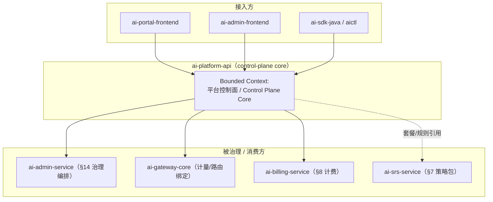
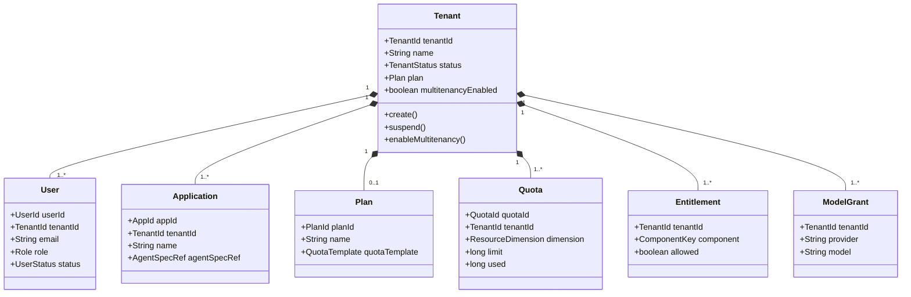
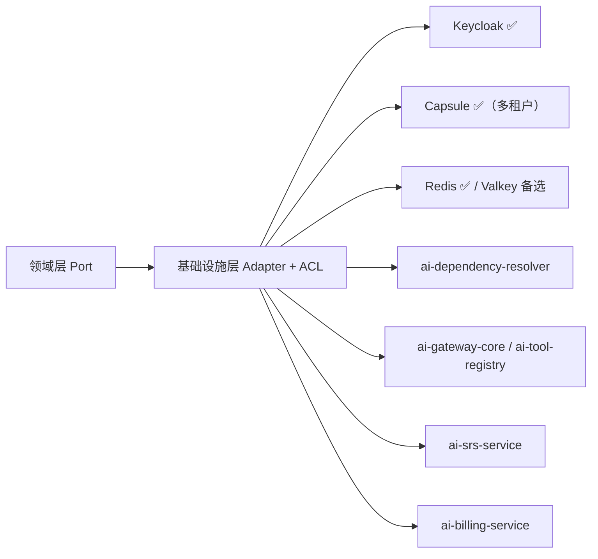
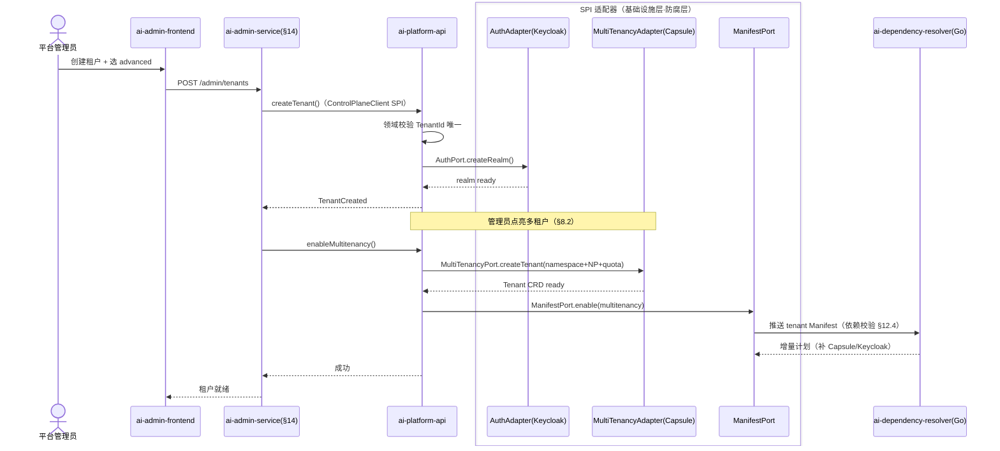
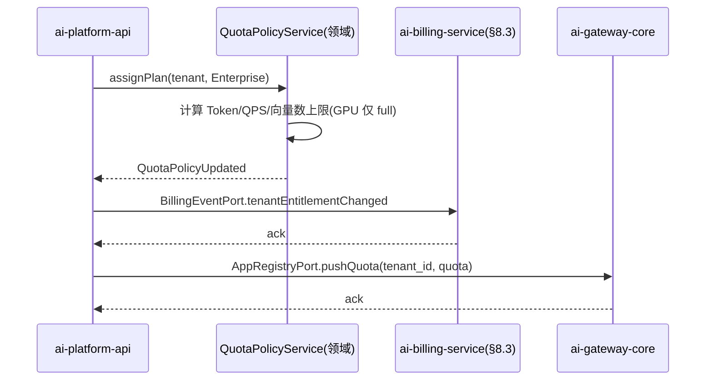

# ai-platform-api · 详细设计文档

> **元信息**
> | 项 | 值 |
> | --- | --- |
> | repo | `ai-platform-api` |
> | 语言·框架 | Java · Spring Boot 3.x（Jakarta Persistence / MyBatis-Flex，§15.6.1） |
> | 领域 | control-plane（平台控制面核心） |
> | optional | 否（core，starter~full 全程启用，见 `repos.yaml` / `profiles/*.yaml`） |
> | 平台版本 | v1.4.0 |
> | 文档状态 | 草稿 |
> | 负责人 | OpenStrata 架构组 |
> | 关联链接 | [arch](./arch/ARCH.md) · [skills](./skills/SKILLS.md) · [specs](./specs/SPECS.md) · 架构文档 [§4.1](../../OpenStrata架构设计文档 v2.8.md) [§8](../../OpenStrata架构设计文档 v2.8.md) [§12](../../OpenStrata架构设计文档 v2.8.md) [§14](../../OpenStrata架构设计文档 v2.8.md) [§15.6](../../OpenStrata架构设计文档 v2.8.md) [§16](../../OpenStrata架构设计文档 v2.8.md) |

> 本文档覆盖现有占位骨架（`design/DESIGN.md` 顶部模板），不改动 `arch/`、`skills/`、`specs/`、`README.md`。章节严格按 16 节组织，图中一律使用 live ```mermaid```。

---

## 1. 领域上下文与边界（Bounded Context）

`ai-platform-api` 是 OpenStrata 的**平台控制面核心 API**，承载"租户 / 用户 / 应用 / 套餐 / 配额 / 多租户点亮"的权威领域模型与写操作。它是 `ai-portal-frontend`、`ai-admin-frontend`、`ai-sdk-java`、CLI（`aictl`）的统一后端，也是 `ai-admin-service`（管理 Portal 后端，§14）与下游数据面/计费服务的事实数据源。



- **边界（上游）**：只接受经 `Auth` SPI（Keycloak，§4.7.3）鉴权、带 `tenant_id` 的请求；自身不做模型推理、不做 RAG、不做计量采集。
- **边界（下游）**：通过领域层定义的 **SPI 端口** + 防腐层（ACL）调用 Keycloak（Auth）、Capsule/K8s（MultiTenancy）、Redis（Cache），并把"租户/用户/应用/配额"事实写入 PostgreSQL（base，§16）。
- **与 ai-admin-service 的关系**：platform-api 是**领域权威（数据 + 规则）**；admin-service 是**治理编排后端**，负责把平台管理员的套餐/配额决策落为 tenant 级 `PlatformManifest`（§12）并联动 Capsule/Kueue/Keycloak。两者经内部 `ControlPlaneClient` SPI（ACL）解耦，admin-service 不直接写 platform-api 的库。
- **可选性**：core，四档预制（starter/standard/advanced/full）均启用，端口 8081（§15.2）。

---

## 2. 职责与能力清单（映射 §4 各层职责）

对齐架构文档 §4 的分层职责，本服务聚焦 **控制面（control-plane）** 与 **安全治理与多租户层（§4.7）** 的"领域权威"部分：

| 能力 | 说明 | 映射 § |
| --- | --- | --- |
| 租户生命周期 | 创建/配置/启停/注销；`tenant_id` 全局唯一，贯穿所有资源（§8.1） | §4.7.1 / §8.1 |
| 用户与身份绑定 | 用户 CRUD、邀请/停用、与 Keycloak 账号映射（§4.7.3） | §4.7.3 / §14.3 |
| 应用（Agent 应用）管理 | 应用注册、绑模型/工具、写入 `AgentSpec` 元数据（§4.3.5） | §4.3.5 |
| 套餐与配额模板 | Trial/Standard/Enterprise 预置，绑定 CPU/Token/QPS/向量数配额（§8.1、§14.2） | §8.1 / §14.2 |
| 多租户点亮 | 按 `multitenancy.enabled` 驱动 Capsule Tenant + Namespace + NetworkPolicy + 数据前缀（§8.2） | §8.2 / §12.1 |
| 权限与审批 | RBAC（platform-admin / tenant-admin / developer / viewer，§14.3）+ 高风险操作审批流 | §4.7.3 / §14.3 |
| 组件范围下发 | 设定租户可启用组件白名单，写入 tenant 级 `PlatformManifest`（§12.1） | §12 / §14.2 |
| 供应商授权 | 按租户开放第三方模型（仅 Enterprise 可用 GPT-4o 等，§14.2） | §14.2 |
| 审计留痕 | 全部租户/用户/配额/应用变更留痕（即便 `security` 未开也审计，§14.6） | §4.7.4 / §14.6 |

> 不做：网关路由/计量采集（ai-gateway-core）、结算出账（ai-billing-service，§8.3）、RAG/记忆（memory/rag）、Agent 运行时。这些通过 SPI 端口协作（§6、§9）。

---

## 3. 领域模型（Aggregate / Entity / Value Object / 领域事件）

遵循 §15.6.2 DDD 四层；领域层零外部依赖，只定义 Port。



**Aggregate（聚合根）**
- `Tenant`（聚合根）：封装 `User` / `Application` / `Plan` / `Quota` / `Entitlement` / `ModelGrant` 的一致性边界；多租户点亮是聚合内的领域行为。
- `Application`（聚合根）：独立生命周期，引用 `AgentSpecRef`（`apiVersion/kind/metadata.name`，§4.3.5）。

**Entity（实体）**：`User`、`Plan`、`Quota`、`Entitlement`、`ModelGrant`、`AgentSpecRef`。

**Value Object（值对象）**：`TenantId`、`UserId`、`AppId`、`PlanId`、`QuotaId`、`TenantStatus`（枚举：PROVISIONING/ACTIVE/SUSPENDED/DELETED）、`Role`（platform-admin/tenant-admin/developer/viewer）、`ResourceDimension`（CPU/TOKEN/QPS/VECTOR/GPU）、`QuotaTemplate`。

**领域事件（DomainEvent，经 Spring `ApplicationEvent` / 领域事件表异步投递）**
- `TenantCreated` → 触发 Capsule Tenant 创建（MultiTenancy SPI）、Keycloak realm 初始化（Auth SPI）。
- `TenantMultitenancyEnabled` → 触发 Namespace/NetworkPolicy/ResourceQuota 下发。
- `PlanChanged` → 重算并校验 `Quota` 上限，发布 `QuotaPolicyUpdated`。
- `EntitlementChanged` → 重写 tenant 级 `PlatformManifest.spec`（经 `ManifestPort`）。
- `UserRoleChanged` / `UserInvited` → 同步 Keycloak 角色/客户端映射。
- `ApplicationRegistered` → 向网关/工具注册广播（经 `AppRegistryPort`）。

---

## 4. 应用层用例（Application Service & Use Case 列表）

应用层（§15.6.2 ②）编排领域对象，定义事务边界（Spring `@Transactional`），CQRS：写走 Command，读走 Query（Projection）。

| Use Case | Application Service | 事务 | 触发领域事件 |
| --- | --- | --- | --- |
| 创建租户 | `TenantAppService.createTenant()` | 写 | `TenantCreated` |
| 启停/注销租户 | `TenantAppService.suspend/resume/delete()` | 写 | `TenantSuspended/Deleted` |
| 点亮多租户 | `TenantAppService.enableMultitenancy()` | 写 | `TenantMultitenancyEnabled` |
| 邀请/停用用户 | `UserAppService.invite/disable()` | 写 | `UserInvited/Disabled` |
| 变更用户角色 | `UserAppService.changeRole()` | 写 | `UserRoleChanged` |
| 注册/注销应用 | `ApplicationAppService.register/unregister()` | 写 | `ApplicationRegistered/Unregistered` |
| 设定/变更套餐 | `PlanAppService.assignPlan()` | 写 | `PlanChanged` → `QuotaPolicyUpdated` |
| 调整配额 | `QuotaAppService.updateQuota()` | 写 | `QuotaPolicyUpdated` |
| 设定组件白名单 | `EntitlementAppService.setEntitlements()` | 写 | `EntitlementChanged` |
| 授权模型供应商 | `ModelGrantAppService.grant()` | 写 | `EntitlementChanged` |
| 查询租户资源画像 | `TenantQueryService.getProfile()` | 读 | —（读 Projection） |
| 审批高风险操作 | `ApprovalAppService.submit/approve()` | 写 | `ApprovalDecided` |

> 每个 Use Case 在入口做 DTO↔领域对象转换，出口统一 `ApiResponse<T>`；跨聚合一致性由聚合根方法保证，跨服务一致性走 §9 的 Saga/事件。

---

## 5. 领域服务与核心业务规则

领域服务（§15.6.2 ③）承载跨实体规则，纯逻辑、可单测：

- **`QuotaPolicyService`**：依据 `Plan.quotaTemplate` 算各维度上限；规则——Token/QPS/向量数为 advanced 起默认治理维度（§14.4 / §8.1 D5），GPU 配额仅当租户启用自托管推理（full 档 `modelServing.enabled`，§12.1）才实际生效。
- **`MultitenancyProvisioningRule`**：仅当 `multitenancy.enabled=true` 且 `auth` 已开（§12.4 依赖校验）才允许点亮；点亮后强制"数据不出租户"（§14.2）。
- **`EntitlementConsistencyRule`**：组件白名单必须与 `PlatformManifest` 兼容（依赖图见 §12.4）；开 `billing` 必已开 `multitenancy`（§12.4 表）。
- **`ModelGrantRule`**：Enterprise 租户方可授权 GPT-4o 等受限模型（§14.2）；经 `LLMProvider` SPI 的供应商授权语义（§4.4.4）。
- **`TenantIdUniquenessRule`**：全局唯一，落到 PostgreSQL 唯一约束 + 领域校验。
- **`ApprovalRule`**：高风险操作（如删除租户、超预算提额）须 `ApprovalDecided` 通过，规则可经 `ai-srs-service` 的 Rules（§7.3）加载为 OPA/Drools 策略（经 `PolicyRulePort` ACL）。

---

## 6. SPI 端口与适配器（Port 定义 + Adapter + ACL 防腐层，映射 §10.4）

领域层（③）只定义 **Port 接口**，基础设施层（④）实现 **Adapter + 防腐层**。同类多实现可并存、切换零改动（§10.4、§15.6.4）。

| Port（领域层定义） | SPI 端口（§10.3 / bom.yaml） | Adapter 实现（默认 ✅ / 备选） | ACL 职责 |
| --- | --- | --- | --- |
| `AuthPort` | `Auth`（§4.7.3） | **Keycloak@25.0.0 ✅**（Apache-2.0, core） | 把外部 token/claims 转成内部 `TenantContext`/`Role` |
| `MultiTenancyPort` | `MultiTenancy`（§8.2） | **Capsule@1.9.0 ✅**（Apache-2.0, optional，仅多租户） | Tenant CRD ⇄ 内部 `IsolationSpec` 映射 |
| `CachePort` | `Cache`（§4.3.4） | **Redis@7.4.0 ✅**（core 默认；Valkey@7.2.0 optional OSI 替代，§16.3） | 租户级 key 前缀隔离 |
| `ManifestPort` | —（配置驱动，§12） | 本地 YAML/PostgreSQL + 经 `ai-dependency-resolver`（Go）下发 | Manifest DTO ⇄ 内部 `TenantConfig` |
| `AppRegistryPort` | — | REST 调用 `ai-gateway-core` / `ai-tool-registry` | 内部 `Application` ⇄ 网关/工具 Schema |
| `PolicyRulePort` | —（§7.3） | REST 调用 `ai-srs-service`（Rules） | Rego/Drools 策略 ⇄ 内部 `ApprovalRule` |
| `BillingEventPort` | —（§8.3） | 事件/REST 调用 `ai-billing-service` | 租户/配额变更事件 ⇄ 计费计量启用 |
| `ControlPlaneClient` | — | REST 调用（供 `ai-admin-service` 消费） | 内部领域对象 ⇄ admin DTO（防腐） |



> **多实现并存示例**：`CachePort` 下 Redis（core）与 Valkey（optional OSI，合规敏感场景切换）经同一 Port 并存，业务零改动（§10.4 / §16.3）。`MultiTenancyPort` 仅 `multitenancy.enabled=true` 时注入 Capsule Adapter，否则为空实现（P10：0 个 Adapter＝能力跳过）。

---

## 7. 对外 API 契约（REST/gRPC 关键路径、状态码、错误码、OpenAPI 要点）

REST（Spring MVC + SpringDoc OpenAPI 3），基准前缀 `/api/v1`，经 `ai-gateway-core` 路由（§4.1.2）。gRPC 仅用于 `ai-admin-service` ↔ `ai-platform-api` 内部 `ControlPlaneClient`（proto 见 `specs/`）。

**关键路径**

```text
POST   /api/v1/tenants                              # 创建租户
GET    /api/v1/tenants/{tenantId}                   # 租户详情
PATCH  /api/v1/tenants/{tenantId}                   # 启停/改套餐
POST   /api/v1/tenants/{tenantId}/multitenancy:enable
GET    /api/v1/tenants/{tenantId}/users
POST   /api/v1/tenants/{tenantId}/users:invite
PATCH  /api/v1/tenants/{tenantId}/users/{userId}:role
GET    /api/v1/tenants/{tenantId}/applications
POST   /api/v1/tenants/{tenantId}/applications
PUT    /api/v1/tenants/{tenantId}/plans             # 设定套餐
PUT    /api/v1/tenants/{tenantId}/quotas            # 调整配额
PUT    /api/v1/tenants/{tenantId}/entitlements      # 组件白名单
PUT    /api/v1/tenants/{tenantId}/model-grants      # 模型供应商授权
GET    /api/v1/tenants/{tenantId}/profile           # 资源画像（读）
POST   /api/v1/tenants/{tenantId}/approvals         # 提交审批
GET    /api/v1/release/manifest                      # 对齐 §16.4 只读能力清单
```

**状态码**：2xx 成功；`400` 参数/业务规则违例；`401` 未鉴权；`403` 越权/未授权模型；`404` 聚合根不存在；`409` `tenant_id` 冲突 / 配额冲突；`422` Manifest 依赖校验失败（§12.4）；`429` 租户 QPS 配额耗尽；`500` 内部。

**错误码（业务码，统一 `ApiError`）**

```json
{
  "code": "TENANT_QUOTA_GPU_DISABLED",
  "message": "GPU 配额仅在启用自托管推理(full 档 modelServing)后生效",
  "traceId": "b3b1...",
  "doc": "https://docs.openstrata.io/errors/TENANT_QUOTA_GPU_DISABLED"
}
```

**OpenAPI 要点**：`openapi.yaml` 由 SpringDoc 生成并归档 `specs/`；所有路径带 `X-Tenant-Id` 头与 `Bearer`；`release/manifest` 与 §16.4 一致；Schema 复用 `AgentSpec`（§4.3.5）引用。

---

## 8. 数据模型与持久化（表结构 / JPA / 迁移脚本）

底座：PostgreSQL@16.0（core，§16 base）。JPA（Hibernate 6 / Jakarta Persistence）。多租户数据隔离用 **Schema per tenant + RLS**（§8.2 隔离矩阵）。

```sql
-- 平台控制面库（shared schema: platform_cp）
CREATE TABLE tenants (
  tenant_id     VARCHAR(64) PRIMARY KEY,
  name          VARCHAR(128) NOT NULL,
  status        VARCHAR(16)  NOT NULL DEFAULT 'PROVISIONING',
  plan_id       VARCHAR(32),
  multitenancy  BOOLEAN      NOT NULL DEFAULT FALSE,
  created_at    TIMESTAMPTZ  NOT NULL DEFAULT now(),
  updated_at    TIMESTAMPTZ  NOT NULL DEFAULT now()
);

CREATE TABLE users (
  user_id    VARCHAR(64) PRIMARY KEY,
  tenant_id  VARCHAR(64) NOT NULL REFERENCES tenants(tenant_id),
  email      VARCHAR(256) NOT NULL,
  role       VARCHAR(16)  NOT NULL,
  status     VARCHAR(16)  NOT NULL DEFAULT 'INVITED',
  kc_id      VARCHAR(64),                       -- Keycloak 映射
  UNIQUE (tenant_id, email)
);

CREATE TABLE applications (
  app_id     VARCHAR(64) PRIMARY KEY,
  tenant_id  VARCHAR(64) NOT NULL REFERENCES tenants(tenant_id),
  name       VARCHAR(128) NOT NULL,
  agentspec_ref VARCHAR(256)                   -- apiVersion/kind/name (§4.3.5)
);

CREATE TABLE plans (
  plan_id         VARCHAR(32) PRIMARY KEY,
  name            VARCHAR(64) NOT NULL,
  quota_template  JSONB NOT NULL                -- {cpu,token,qps,vector,gpu}
);

CREATE TABLE quotas (
  quota_id   VARCHAR(64) PRIMARY KEY,
  tenant_id  VARCHAR(64) NOT NULL REFERENCES tenants(tenant_id),
  dimension  VARCHAR(16) NOT NULL,             -- CPU/TOKEN/QPS/VECTOR/GPU
  limit_val  BIGINT NOT NULL,
  used_val   BIGINT NOT NULL DEFAULT 0,
  UNIQUE (tenant_id, dimension)
);

CREATE TABLE entitlements (
  tenant_id  VARCHAR(64) NOT NULL REFERENCES tenants(tenant_id),
  component   VARCHAR(48) NOT NULL,            -- gateway/rag/srs/billing...
  allowed     BOOLEAN NOT NULL DEFAULT FALSE,
  PRIMARY KEY (tenant_id, component)
);

CREATE TABLE model_grants (
  tenant_id VARCHAR(64) NOT NULL REFERENCES tenants(tenant_id),
  provider  VARCHAR(32) NOT NULL,
  model     VARCHAR(64) NOT NULL,
  PRIMARY KEY (tenant_id, provider, model)
);

CREATE TABLE audit_log (                       -- 不可变审计（§4.7.4/§14.6）
  id          BIGSERIAL PRIMARY KEY,
  tenant_id   VARCHAR(64),
  actor       VARCHAR(64) NOT NULL,
  action      VARCHAR(64) NOT NULL,
  payload     JSONB,
  created_at  TIMESTAMPTZ NOT NULL DEFAULT now()
);
```

**JPA 实体**：`TenantEntity`/`UserEntity`/... 映射到上述表；`@Convert` 序列化 `quota_template`/`payload` JSONB；迁移用 **Flyway**（V1__init.sql、V2__rls.sql），脚本随仓 `src/main/resources/db/migration/`。

---

## 9. 关键业务流程与时序图（Mermaid 时序，含跨服务 SPI 调用）

**流程 A：创建租户并点亮多租户（advanced 档）**



**流程 B：设定套餐 → 配额生效 → 计费联动（§8.1/§8.3）**



---

## 10. 配置与 Profile（对齐 meta profiles：starter~full + 可选能力开关）

本服务进程自身配置（`application.yml` / `infrastructure/config/platform-api.yaml`），**能力开关对齐 `profiles/*.yaml` 与 `PlatformManifest.spec`（§12.1）**：

```yaml
openstrata:
  service:
    port: 8081
  features:                       # 对齐 §12.1 Manifest spec 开关
    multitenancy:
      enabled: false              # starter/standard=false；advanced/full=true（§12.2）
    billing:
      enabled: false              # 仅多租户（advanced/full）联动 ai-billing-service
    security:
      enabled: false              # 高级护栏(Skills/Rules)经 ai-srs-service；基础风控 core 常开
    riskControl:
      enabled: true               # core 默认开（§4.7.4）：限流+注入/PII 扫描
  spi:
    auth:
      provider: keycloak          # core 默认（§4.7.3）
    multitenancy:
      provider: capsule          # optional，仅多租户点亮
    cache:
      provider: redis             # 默认；valkey 为 OSI 备选（§16.3）
```

| Profile | 本服务启用要点 |
| --- | --- |
| starter | `multitenancy=false`、`billing=false`、`auth=keycloak`、`cache=redis` |
| standard | 同 starter（仍单租户） |
| advanced | `multitenancy=true`（Capsule Adapter 注入）、`billing` 联动开启 |
| full | 同 advanced + `security` 高级护栏（授权 ai-srs-service） |

> 开关由 `ai-dependency-resolver` 依 Manifest 注入，进程**无状态**，配置外置（§15.6.2 云原生）。

---

## 11. 集成点（依赖的其他服务 / SPI / 外部 OSS，引用 bom.yaml）

| 集成点 | 类型 | 实例（bom.yaml） | 说明 |
| --- | --- | --- | --- |
| Keycloak | 外部 OSS（Auth SPI） | keycloak@25.0.0 ✅ core | 鉴权/用户/角色（§4.7.3） |
| Capsule | 外部 OSS（MultiTenancy SPI） | capsule@1.9.0 optional | 仅多租户（§8.2） |
| Redis / Valkey | 外部 OSS（Cache SPI） | redis@7.4.0 ✅ core / valkey@7.2.0 optional | 缓存/会话（§16.3） |
| PostgreSQL | base 底座 | postgresql@16.0 ✅ core | 持久化（§16 base） |
| ai-dependency-resolver | 内部服务 | Go，tag v1.4.0 | Manifest 依赖解析与下发（§13.3） |
| ai-admin-service | 内部服务 | Java，tag v1.4.0 | 治理编排消费本服务（§14） |
| ai-gateway-core | 内部服务 | Go，tag v1.4.0 | 配额/应用注册推送（§15.2） |
| ai-billing-service | 内部服务 | Java，tag v1.4.0 | 计费联动（§8.3，仅多租户） |
| ai-srs-service | 内部服务 | Java，tag v1.4.0 | Rules/策略包（§7.3，可选） |
| ai-tool-registry | 内部服务 | Go，tag v1.4.0 | 应用↔工具 Schema（§4.3.2） |

---

## 12. 安全与多租户（鉴权 / 权限 / 数据隔离 / 审计，映射 §8·§14）

- **鉴权**：所有请求经 `AuthPort`（Keycloak OIDC/JWT），网关注入 `X-Tenant-Id`；服务间用 `ControlPlaneClient` mTLS（Istio，§4.7.3）。
- **权限**：RBAC 四角色（platform-admin / tenant-admin / developer / viewer，§14.3）；平台级 vs 租户级作用域严格分离；管理员操作 MFA（§14.6）。
- **数据隔离**：control-plane 库用 `tenant_id` 列级隔离 + RLS；多租户点亮后业务数据走 **Schema per tenant + RLS / Milvus Collection 前缀 / MinIO Bucket**（§8.2 矩阵）。本服务自身不持有向量/对象数据，只下发隔离策略。
- **审计**：`audit_log` 不可变、全量留痕（即便 `security` 未开，管理面变更也审计，§14.6）；审计事件同时进 OTel（§13 可观测性）。
- **多租户点亮条件**：`multitenancy.enabled=true` 且 `auth` 已开（§12.4 依赖校验）；否则整层跳过（§4.7 单租户形态）。

---

## 13. 可观测性（日志 / 追踪 / 指标 / 审计埋点）

- **基础 Tracing + Audit（core，§4.8）**：OpenTelemetry traces 全链路 + 不可变 `audit_log` 默认开。
- **Metrics（推荐）**：Micrometer → Prometheus；关键指标：`tenant_count`、`quota_used_ratio{dimension}`、`api_qps`、`api_error_rate`、`approval_pending`、`spi_adapter_calls{port,provider}`。
- **Logging**：结构化 JSON（MDC 注入 `tenant_id`/`traceId`），Loki 收集（可选）。
- **LLM 专项追踪**：不直接产生，但审计/操作事件可经 `Tracing` SPI（Langfuse@2.0.0 ✅）关联。
- **审计埋点**：`@Audit` 注解在应用层切面统一落 `audit_log`，含 actor/action/payload/traceId。

---

## 14. 部署与弹性（K8s 资源 / HPA / 探针）

- **Deployment**：`ai-platform-api`，无状态，2~3 副本；镜像 `openstrata/ai-platform-api:v1.4.0`。
- **命名空间**：共享 `ai-system`（§9.2）；多租户数据隔离在 `ai-tenant-{x}`。
- **探针**：
  - liveness：`GET /actuator/health/liveness`
  - readiness：`GET /actuator/health/readiness`（依赖 PostgreSQL/Redis/Keycloak 连接）
- **HPA**：基于 `cpu` + `api_qps`，min 2 / max 10。
- **资源**：request 500m CPU / 1Gi，limit 1 CPU / 2Gi。
- **配置**：ConfigMap + Secret（DB/Keycloak 凭据），经 Helm values 由 `ai-provisioning-engine` 渲染（§13.3）。

---

## 15. 测试策略（单测 / 集成 / 契约测试）

- **单测（领域层，最快、零框架）**：`QuotaPolicyService` / `MultitenancyProvisioningRule` / `EntitlementConsistencyRule` 纯逻辑单测（JUnit 5 + AssertJ），覆盖率目标 ≥ 85%。
- **集成（Spring Boot Test + Testcontainers）**：PostgreSQL + Redis 容器，验证 JPA 映射、Flyway 迁移、事务边界。
- **SPI 契约测试**：`AuthPort`/`MultiTenancyPort`/`CachePort` 与 Adapter 实现对照 `bom.yaml` `interface_versions` 做契约校验（对齐 `skills/SKILLS.md` 的 `bump-spi-version`）。
- **跨服务契约**：与 `ai-admin-service` 的 `ControlPlaneClient` proto / REST 契约测试；与 `ai-gateway-core` 的配额推送契约。
- **E2E**：在 `demo/<profile>`（§15.5）按 starter→advanced 跑创建租户→点亮多租户→设套餐全链路。

---

## 16. 开放问题与待决项

1. **GPU 配额语义**：full 档自托管推理下 GPU 配额的 Kueue ClusterQueue 下发由谁主导（platform-api 还是 admin-service）？建议 admin-service 编排、platform-api 仅存策略。
2. **control-plane 与 admin-service 职责切分**：两者都涉及租户/用户/配额，需以 ADR 固化"platform-api=权威数据/规则，admin-service=治理编排"边界，避免双写。
3. **Schema-per-tenant vs RLS**：单租户默认（starter）是否也建独立 schema？倾向 RLS 统一，降低运维复杂度。
4. **审计保留与合规**：审计日志保留周期、是否入 ELK 聚合（§4.7.4 可选）待定。
5. **Entitlement 与 Manifest 一致性**：tenant 级 `PlatformManifest` 由 admin-service 写、platform-api 读，需定义最终一致性的收敛时延 SLA。
6. **BOM 兼容性**：Keycloak 25 → 26 升级、Capsule 1.9 → 2.x CRD 变更需在 `bom.yaml` 跟踪（§16.1）。

---

> **变更记录**
> | 版本 | 日期 | 说明 |
> | --- | --- | --- |
> | v1.0-草稿 | 2026-07-17 | 初始详细设计，覆盖占位骨架，16 节齐备 |

> **追溯矩阵（本文档章节 ↔ 架构设计文档 § 编号）**
> | 章节 | 架构文档 § |
> | --- | --- |
> | 1 领域上下文 | §4.7 / §8.1 / §14.1 |
> | 2 职责清单 | §4（各层职责）/ §4.7 / §15.2 |
> | 3 领域模型 | §15.6.2 / §8.1 |
> | 4 应用层用例 | §15.6.2 ② |
> | 5 领域服务规则 | §8.1 / §14.2 / §12.4 |
> | 6 SPI 端口与适配器 | §10.3 / §10.4 / §15.6.4 |
> | 7 对外 API 契约 | §4.1.2 / §16.4 |
> | 8 数据模型 | §8.2 / §16 base |
> | 9 业务流程时序 | §8.2 / §8.3 / §15.6.2.2 |
> | 10 配置与 Profile | §12.1 / §12.2 / §12.4 |
> | 11 集成点 | §4.7.3 / §15.2 / bom.yaml |
> | 12 安全与多租户 | §8 / §14.3 / §14.6 / §4.7.4 |
> | 13 可观测性 | §4.8 |
> | 14 部署与弹性 | §9.2 |
> | 15 测试策略 | §15.6.5 |
> | 16 开放问题 | — |
